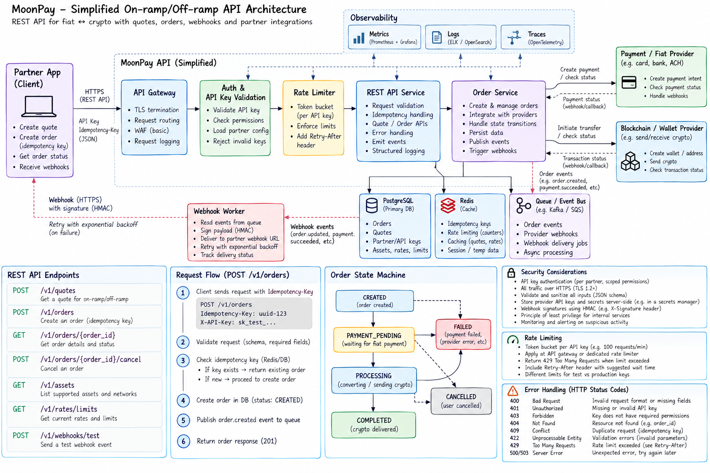

# MoonPay API Design

A simplified REST API design for handling fiat-to-crypto and crypto-to-fiat transactions.

The goal was to keep the API small while still covering the parts I'd expect in a production system: authentication, validation, idempotency, rate limiting, asynchronous processing, webhooks, and failure handling.

## Architecture



## API at a glance

The API is centered around two main resources:

- **Quotes** — short-lived exchange quotes
- **Orders** — the actual transaction and its lifecycle

Main endpoints:

| Method | Endpoint | Purpose |
|---|---|---|
| `POST` | `/v1/quotes` | Create a quote |
| `POST` | `/v1/orders` | Create an order |
| `GET` | `/v1/orders/{order_id}` | Get order status |
| `POST` | `/v1/orders/{order_id}/cancel` | Cancel an order |
| `GET` | `/v1/assets` | List supported assets |
| `GET` | `/v1/rates/limits` | Get rates and limits |
| `POST` | `/v1/webhooks/test` | Test webhook delivery |

## Important design choices

### Authentication

Partners authenticate using an API key:

```http
X-API-Key: sk_live_xxxxx
